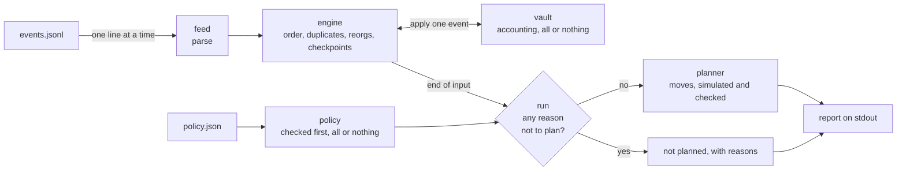

# Notes

The program reads the event feed, works out each vault's current state, and
plans moves towards the policy without breaking any cap.

## Running

```bash
cargo run                  # uses data/events.jsonl and data/policy.json
cargo run -- --events path/to/events.jsonl --policy path/to/policy.json
RUST_LOG=info cargo run    # also prints a log line for every event
cargo run -- --help        # the options
cargo test                 # unit and integration tests
```

The same with `make`. `make help` lists every target, and `PROFILE=release`
switches `build`, `run`, the test targets and `smoke` to a release build (the
Docker image is always a release build):

```bash
make run                   # cargo run
make run ARGS="--events path/to/events.jsonl --policy path/to/policy.json"
make test                  # all tests; or make test-unit / make test-integration
make check                 # formatting, clippy and all tests
make smoke                 # run on the given data and check which vaults are planned
```

With Docker, no Rust needed. The image has the binary and the given data:

```bash
make docker-build          # docker build -t curator-manager .
make docker-run            # docker run --rm curator-manager
docker run --rm -v "$PWD/my-data:/in:ro" curator-manager \
  --events /in/events.jsonl --policy /in/policy.json
```

You need stable Rust (edition 2024; we used 1.99.0). The report goes to
stdout and logs go to stderr. With the given data, `vault-core` and
`vault-yield` get a plan. `vault-legacy` does not: it has a deposit but no
`VaultCreated`, and no entry in the policy.

**Logs and counts.** Logs go to stderr. By default only warnings and errors
are shown: a vault waiting for an earlier event, a skipped or broken line,
and each reason a vault gets no plan. `RUST_LOG=info` adds one line per
event (applied, queued, replayed, duplicate, reorg). Every line carries a
run ID, and every message about an input line carries its line number, so
it can be traced back to the line that caused it. The last line at `info`
level counts what happened in the run: lines read, events accepted (stored;
an accepted event can still be waiting behind a stuck one), duplicates,
conflicts, unknown kinds, broken lines, reorgs and the events they removed.

## How it works



| Module | What it does |
|---|---|
| `event` | The shared types: events, reorgs and lines that could not be read |
| `feed` | Turns one JSON line into an event. Only this file knows the JSON format |
| `vault` | Applies one event to a vault. Either the whole event is applied or nothing changes |
| `engine` | Puts events in order, ignores repeats, handles late events and reorgs, and tracks bad input |
| `policy` | Reads and checks the policy file |
| `planner` | Works out the moves, then tests them on a copy of the vault |
| `run` | Reads the file, then decides which vaults can get a plan |
| `report` | Holds the result for each vault and prints it |
| `main` | Reads the command-line options and sets up logging |

## Design decisions

Each one is written as problem, approach, and cost.

**1. Late events and reorgs.** *Problem:* events can arrive out of order,
and a reorg can remove blocks we already applied. *Approach:* apply each
event when it arrives. Every 10 blocks, save a copy of the vault (a
checkpoint). When a late event arrives or a reorg removes blocks, go back to
the last checkpoint before that block and apply the later events again.
*Cost:* the copies use memory. Some reorg cases can't be told apart (see
"What we chose not to handle").

**2. Repeated and broken events.** *Problem:* the same event can arrive more
than once, and some lines are broken. *Approach:* an event is identified by
its block and log index, across all vaults. An exact repeat is ignored. A
vault gets no plan, and the report says why, if:
- one of its events is broken, but the line is still valid JSON that names
  the vault and a supported kind (if we can tell which event it was, a good
  copy arriving later releases the hold),
- two different events have the same block and log index (both vaults are
  held),
- an event removed by a reorg comes back,
- the same reorg message comes twice and removes events,
- a second `VaultCreated` has different decimals, or
- a deposit or withdrawal gives something for nothing: assets paid out with
  no shares burned, or shares minted for no assets. It is still applied as
  reported, but holder values can't be trusted. The opposite (a tiny deposit
  that mints 0 shares, or a tiny redemption that pays 0 assets) is normal
  rounding in the vault's favour, so it is only a note.

*Cost:* one bad event stops one vault's plan.

**3. Events that can't be applied.** *Problem:* an event may need something
that isn't there yet, like a deposit before `VaultCreated`. *Approach:* stop
that vault at that event. A late earlier event can fix it. If it is still
stuck at the end, it gets no plan. *Cost:* none for other vaults; they carry
on.

**4. Exact maths.** *Problem:* money must never be rounded wrongly or
overflow. *Approach:* all amounts are whole numbers (`u128`), every sum is
checked, and multiply-then-divide uses a 256-bit middle step. An event is
fully checked before anything changes. *Cost:* an overflow is an error
instead of a result.

**5. Caps and targets.** *Problem:* the policy may ask for more than a cap
allows. *Approach:* target = `min(floor(total × bps / 10,000), cap)`. No cap
means a cap of zero. Blocked money stays idle, and so does whatever a policy
under 100% doesn't assign (that is logged). A vault not in the policy gets
no plan; `{}` moves all of its money to idle. A policy file with any mistake
is rejected whole. *Cost:* part of the policy can stay unmet.

**6. Small, safe plans.** *Problem:* moves must not take money that isn't
there. *Approach:* each strategy that is off target gets exactly one move.
Moves out of strategies come first, so idle always has enough for the moves
in. *Cost:* none; this is also the fewest moves.

## How we checked that the state and plans are correct

We use both unit tests and integration tests.

- **Integration tests** (`tests/cli.rs`) run the built program on input
  files and read its printed report. Besides the given data, `tests/data/`
  has 19 small scenarios with one vault each, in the same format. Eleven are
  clean inputs that should be planned: deposits and allocations, yield and
  withdrawals, a vault already on target, moving money between strategies
  with rounding, a deposit and a redemption that round to zero, an empty
  policy entry, caps, late and repeated events, a reorg, a stuck vault fixed
  by a late event, and lines that only give warnings (including a line cut
  off mid-way). Eight should not be planned: a stuck vault, a broken event, a
  line that isn't valid UTF-8, a withdrawal that burns no shares, two events
  with the same key, a vault missing from the policy, a vault never created,
  and a policy file with mistakes. `--help` and the command-line errors are
  tested too.
- **Every plan is checked independently.** For each planned vault, the
  integration test runs the printed moves itself, using only the printed
  state and the policy file. It checks that each move only takes money the
  source has, that moves out of strategies come first, that total assets
  don't change, that no strategy ends above its cap, and that every strategy
  ends exactly at `min(floor(total × bps / 10,000), cap)`, and that a policy
  strategy the vault has never seen gets no move. It also checks that each
  holder's value follows from their shares. We broke the planner on purpose
  twice (ignoring caps, and putting moves in the wrong order) to make sure
  these tests fail.
- **The given data:** we worked out the expected balances, holder values and
  moves by hand, and the integration test checks those exact numbers.
- **Each plan is also tested inside the program before it is shown.** If any
  check fails, the vault gets no plan.
- **Unit tests** cover the edge cases that are hard to set up through files:
  the largest possible amounts, overflow, block numbers near the `u64` limit,
  checkpoints, several events in one block, two reorgs in a row, repeated
  reorg messages, and each kind of bad input.
- **No panics.** Clippy forbids `unwrap`, `expect`, `panic!` and indexing
  outside tests, and all maths is checked. `tests/fuzz.rs` also runs the
  program on 700 randomly broken feeds and policies built from the data
  files (cut-off lines, flipped bytes, wrong types, huge, negative and
  fractional numbers, shuffled and repeated lines, random reorgs). It uses
  a fixed seed, so every run is the same, and it runs with `cargo test`. We
  checked that it fails if a panic is added.
- **CI** (`.github/workflows/ci.yml`) runs only `make` targets, so it does
  exactly what you can run locally. It checks formatting and clippy;
  compiles, runs the unit tests, the integration tests and `make smoke` on
  Ubuntu and macOS, in both debug and release; and builds the Docker image
  and runs it on the given data.
- We also ran `make check` from scratch in clean Ubuntu 22.04 and 24.04
  containers, and built and ran the Docker image for both ARM and x86-64.

## What we chose not to handle, and why

- **Some reorg cases can't be told apart.** The feed has no block hashes or
  message IDs, so these cases look exactly the same as other cases:
  - *An old event arriving after its reorg.* After `reorg from 12`, a
    deposit at block 12 that we have never seen could be an old event (which
    should be dropped) or its replacement (which should count). We count it.
  - *A new event arriving before its reorg.* If the replacement for block 12
    arrives before `reorg from 12`, the reorg removes it. We assume reorg
    messages come before their new events.
  - *The same reorg message twice.* It could be a repeat or a second real
    reorg. If applying it again would remove events, we stop that vault's
    plan. Otherwise it changes nothing.

  We also assume the end of the file is the end of the history.

  So the state is correct for any delivery order within one chain branch,
  but not for every possible order of reorgs and late events. That would
  need more from the indexer: block hashes (so each event says which branch
  it belongs to), or an order and completeness guarantee covering events and
  reorg messages together. Ordering only the reorg messages is not enough,
  because a later event still doesn't say which branch it is from. Until
  then, the results are correct only as long as the assumptions above hold.
- **A held vault stays held for the whole run.** If a vault is held because
  of a conflict, a repeated reorg or a returning removed event, a later reorg
  that removes the cause does not release it. Without block hashes we can't
  prove the problem is gone; only a corrected feed (a resync) clears it.
- **An honest re-inclusion is also held.** After a reorg, the same event can
  really be included again on the new branch. It looks exactly like the
  removed copy coming back, so we apply it but hold the vault. That is a
  false alarm we accept, rather than risk planning on the wrong branch.
- **Some bad input only gives a warning.** An event type we don't know, a
  line that isn't valid JSON (even if a vault name is visible in it, for
  example a line cut off mid-way), and a broken reorg message. These are
  warnings so that one bad line can't stop every vault, and we assume they
  don't change any balances. A line that is valid JSON and names its vault
  and a supported kind does stop that vault's plan. We don't try to read a
  vault out of broken JSON, because text inside `data` could be mistaken for
  it.
- **A skipped reorg can leave old events.** If a broken reorg message was a
  real reorg and no good copy of it arrives, the state keeps the events it
  should have removed. The state is only canonical if the reorg messages
  arrive readable.
- **Typos in strategy names.** If the policy names a strategy the vault has
  never seen, it shows "cap none, reachable 0". The given data has one on
  purpose (`ether-fi`), so we can't reject unknown names.
- **Checking minted shares.** That needs the vault's fee and price rules,
  which the brief doesn't give. We use the share amounts from the events.
- **Durable storage.** Everything is kept in memory and is gone when the
  program ends. For this exercise that is enough: each run reads the whole
  file again. Part 2 adds a database.
- **Liquidity, fees, gas and a minimum move size.** None of these are in the
  data.

## What we would do next

- Warn when a policy strategy name looks like a typo of a real one (`aaave`
  instead of `aave`).
- Add a minimum move size, so tiny differences don't create tiny moves. It
  must never leave a strategy above its cap.
- Make plans on request while the feed is running, not only at the end.
- Use less memory: each checkpoint copies the full list of holders.
- Then Part 2.

## Part 2: dozens of vaults, a live feed, and sending moves to the chain

```
indexer → save the message → database → vault state → planner → sender → chain
              ↑                                                       │
              └──────────── our own transactions come back ───────────┘
```

**Start small.** One service and one Postgres database is enough for dozens
of vaults. Split it up only when measurements show a need.

**1. Receiving events**
- *Normally:* save each message to the database, then tell the queue we have
  it. Then apply it to the vault, as today.
- *After a crash:* rebuild each vault from its last saved checkpoint.
  Repeated messages are ignored, so getting one again is safe.
- *Reorgs:* ask the indexer for block hashes, message IDs and sequence
  numbers. Block hashes tell old events from new ones, message IDs show a
  repeated reorg, and sequence numbers show a missing message. While a vault
  is being rebuilt after a reorg, don't plan it.

**2. Creating plans**
- *Normally:* only plan from complete data. The indexer tells us "complete up
  to block N" (every event up to N has arrived) and, separately, "final up
  to block F" (that part of the chain won't change). Each plan saves the
  vault's state version and policy version. A state version only goes up,
  even when a reorg rolls the state back.
- *If something changed:* if the state or policy has a newer version, throw
  the plan away and make a new one.

**3. Sending transactions**
- *Normally:* one sender signs and sends each plan, one plan at a time per
  vault. Each step is saved: planned → signed → sent → confirmed → final.
  Just before sending, read balances and caps again and test the moves. The
  contract rejects any move that breaks a cap.
- *Save before sending:* save the signed transaction and its nonce before
  broadcasting it. Vaults that share one signing key share one nonce
  counter, so nonces are handed out in one place.
- *Transaction failed (reverted):* make a new plan from the latest state.
  Never resend the same plan.
- *Not sure what happened (for example, after a crash):* look up the saved
  transaction, its receipt, and the vault's state on chain before doing
  anything else. Sending the same saved signed transaction again is safe;
  building a new one could make the move twice.
- *Only some moves happened:* make a new plan from the new state.
- *A reorg undid it:* check the plan again, and cancel it if it no longer
  makes sense. Cancelling may not work, so track both the original and the
  cancel transaction until one of them is final.
- *Safety:* the curator key can only call allocate and deallocate (the
  contract enforces this), is kept in an HSM, and is used only by the sender.
  A pause switch stops new transactions.

**4. Monitoring**
- *Metrics:* export to Prometheus how many events were received, repeated,
  broken or late, how many reorgs happened, how long rebuilding took, how far
  behind the chain we are, how many vaults have no plan, and the result of
  every transaction.
- *Dashboards:* Grafana dashboards showing, per vault, the state, how far it
  is from its targets, its plans and transactions, and the feed's delay.
- *Checking against the chain:* a regular job reads each vault's balances
  and caps from the chain at a known block, named by its hash and not just
  its height, and compares them with our state at the same block.
- *Alerts:* alert when processing stops or falls behind, when a vault has no
  plan for a long time, when plans are rejected, when a transaction fails or
  its outcome is unknown, or when the check against the chain finds a
  difference. Targets blocked by a cap are shown on the dashboard but don't
  cause an alert.
- *Logs:* structured logs with the run ID on every line, and the vault, event
  and input line where they apply, so an alert can be traced back to the
  event that caused it.
